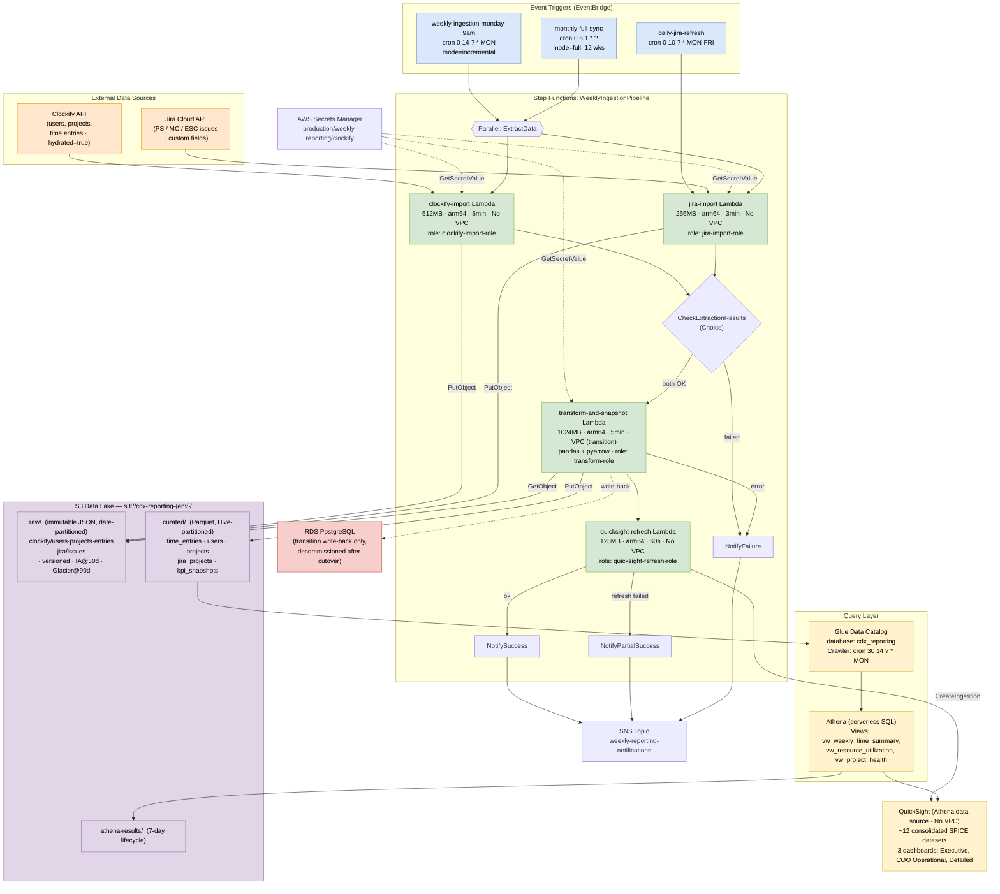
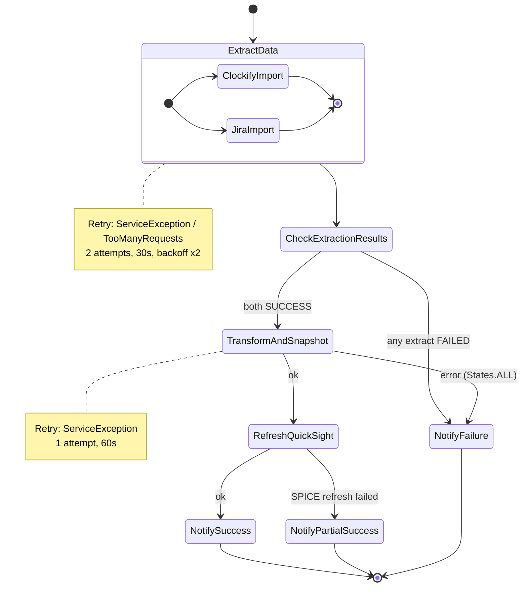
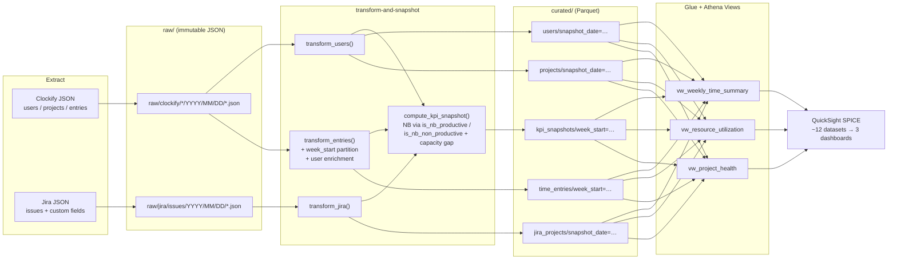
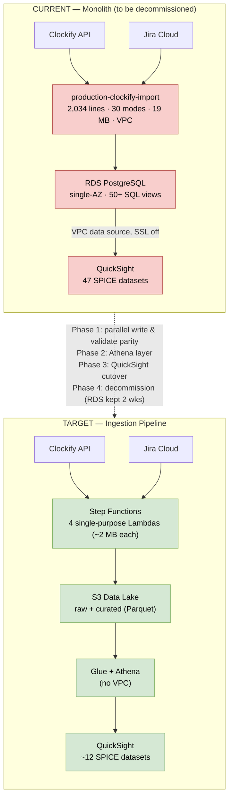
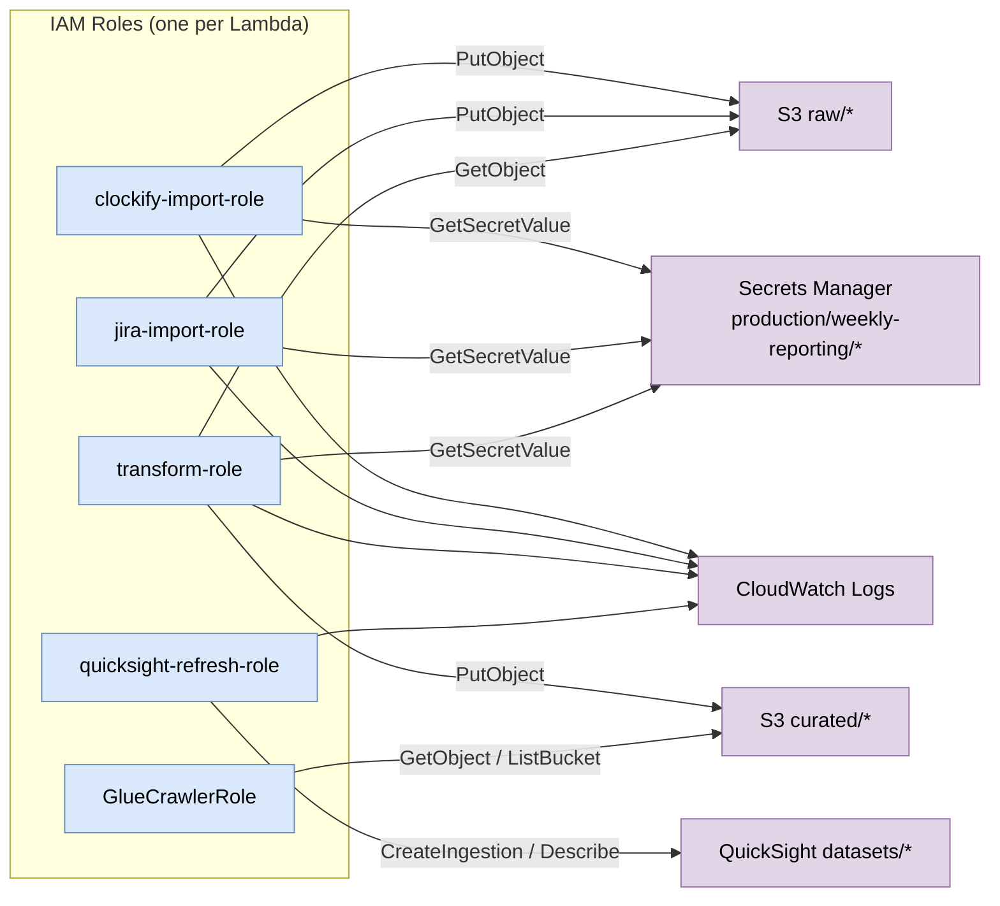

# Weekly Reporting — Ingestion Pipeline Architecture Diagrams

**Date:** 2026-08-28
**Account:** 961341524729 | **Region:** us-east-1
**Sources:** `docs/ingestion-pipeline-spec.md`, `docs/architecture-and-fixes-highlevel.md`

These diagrams show the **proposed ingestion pipeline** (Step Functions + single-responsibility Lambdas + S3 data lake + Glue/Athena) integrated into the **entire system architecture**, plus the migration/transition state and the current-vs-target comparison.

---

## 1. Target Architecture — End-to-End (Integrated View)

The complete proposed system: event triggers → Step Functions orchestration → extraction → data lake → query layer → QuickSight, with security and network boundaries called out.

---

## 2. Step Functions State Machine (Control Flow)

The orchestration logic in isolation — parallel extract, choice gate, sequential transform → refresh, and the three notification terminal states.

---

## 3. Data Flow Through the Lake Layers

Shows how a single weekly run moves data from raw JSON to Parquet to Athena views to SPICE.

---

## 4. Current vs Target (Migration Context)

Side-by-side of the monolith being replaced and the target pipeline, and the transition period where both run in parallel.

---

## 5. IAM / Security Boundaries

Least-privilege role-to-resource mapping for the pipeline.

---

## Notes

- **VPC boundary:** Only `transform-and-snapshot` runs in a VPC, and only during the transition period for RDS KPI write-back. After cutover it becomes VPC-free — no Lambda needs a VPC, and the QuickSight read path has no VPC dependency at all.
- **NB classification** carries over into `transform-and-snapshot`: it reads the two Clockify checkbox custom fields (`is_nb_productive`, `is_nb_non_productive`) flattened from raw JSON, plus the per-user capacity gap for NB Non-Productive. The brace-formatting issue disappears structurally because transforms flatten clean values from raw JSON.
- **Reprocessability:** `raw/` is immutable and versioned, so any historical week can be re-transformed without re-calling Clockify/Jira.
- Diagrams are Mermaid — they render in GitHub, VS Code (with a Mermaid extension), and most Markdown viewers. To export as images, paste into [mermaid.live](https://mermaid.live) or use the Mermaid CLI.
